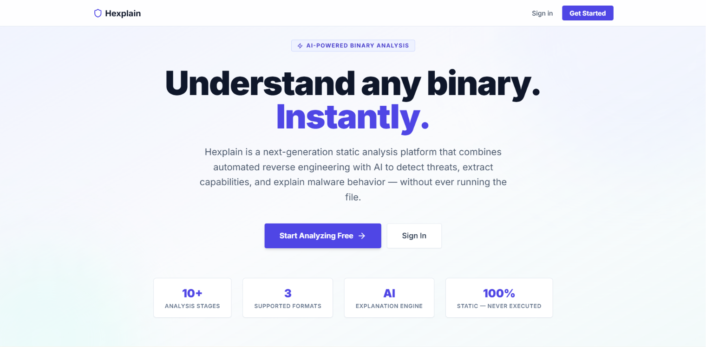
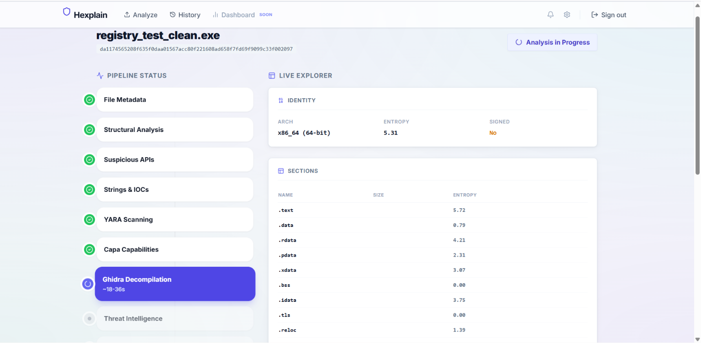
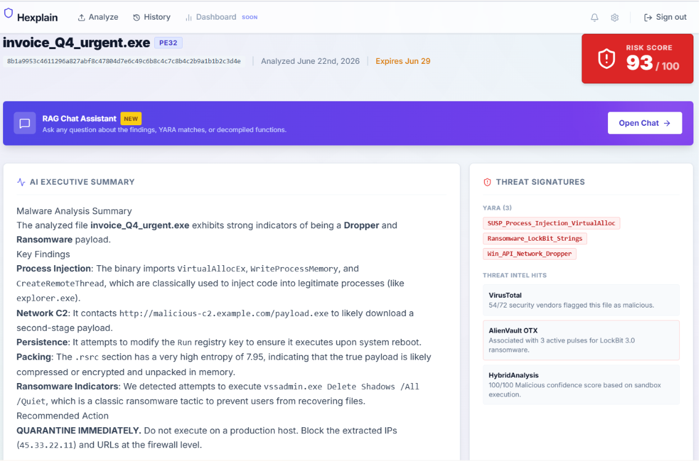
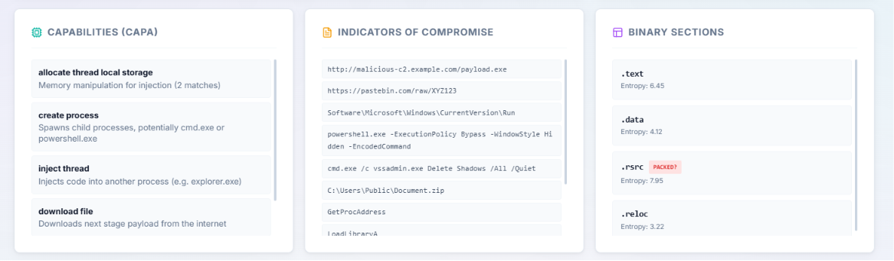
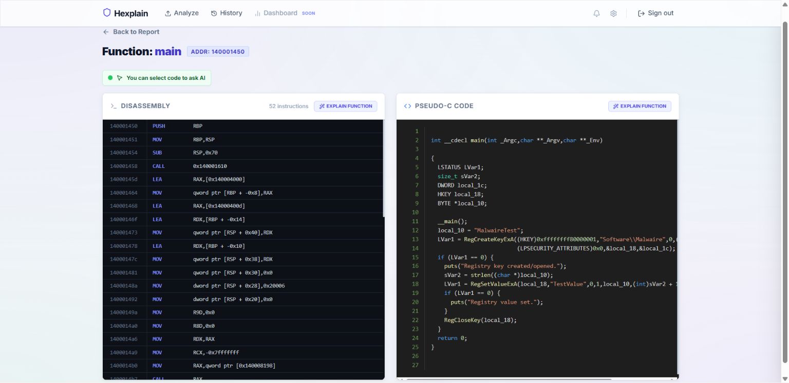
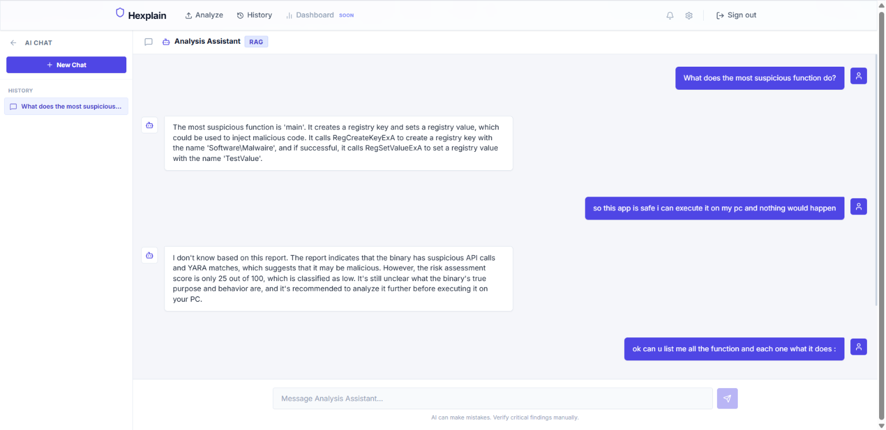
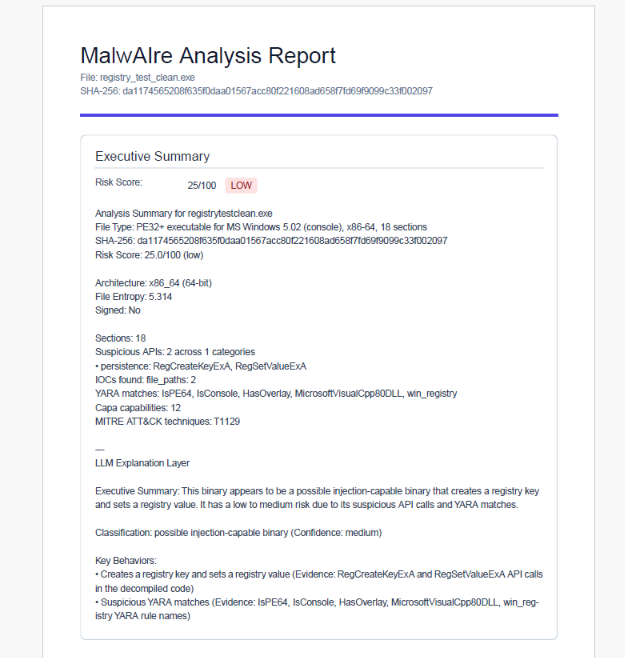

# Hexplain — AI-Assisted Binary Analysis Platform

**Hexplain** is a production-ready platform for static analysis of PE/ELF/.NET executables, powered by large language models (LLM) and Retrieval-Augmented Generation (RAG). It transforms opaque binary content into plain-language cybersecurity reports with defensible risk scores — making malware analysis accessible to both experts and beginners.

---

## The Problem

Static analysis of executable binaries is one of the most specialized and time-consuming skills in cybersecurity. An analyst typically needs:

- Mastery of x86/x64 assembly language (2+ years of practice)
- Knowledge of PE and ELF file formats, import tables, entropy analysis
- Proficiency with tools like Ghidra, IDA Pro, YARA, and Mandiant Capa
- Manual correlation of results across multiple disconnected tools
- 4 to 8 hours per binary for a thorough analysis

Hexplain eliminates these barriers by automating the full analysis pipeline and translating raw technical outputs into natural-language explanations anyone can understand.

---

## Solution

A unified pipeline that, from a single file upload:

1. Runs 9 static analysis modules in sequence (metadata, structure, suspicious APIs, strings/IOC, YARA, Capa/MITRE ATT&CK, decompilation, threat intelligence, heuristic scoring)
2. Sends the consolidated results to an LLM (Gemini 2.0 Flash or Llama-3.1 via Groq) for natural-language report generation
3. Indexes the report in a local ChromaDB vector store
4. Exposes a contextual RAG chatbot that answers questions about the binary exclusively from the report data

---

## Platform Screenshots

**Landing Page**



**Analysis Pipeline — Live Progress**



**Full Analysis Report (CRITICAL — 93/100)**



**Capabilities (Capa/MITRE), IOC and Binary Sections**



**Decompiled Functions — Disassembly + Pseudo-C Side by Side**



**RAG Chatbot — AI Copilot**



**PDF Export**



---

## Architecture

```
Client (Browser)
       |
       v
  Frontend (Next.js 14 — :3000)
       |
       v HTTP REST
  API (FastAPI — :8000)
       |              \
       |               v
    Redis          SQLite (hexplain.db)
    Broker              |
       |           ChromaDB (RAG embeddings)
       v
  Worker (Celery — concurrency=1)
       |
       |--- Module 1: Metadata + Entropy
       |--- Module 2: PE/ELF Structure (LIEF)
       |--- Module 3: Suspicious API Detection
       |--- Module 4: Strings + IOC Extraction
       |--- Module 5: YARA Rule Scanning
       |--- Module 6: Capa (MITRE ATT&CK)
       |--- Module 7: Ghidra / ILSpy Decompilation
       |--- Module 8: Threat Intel (VirusTotal, MalwareBazaar, OTX)
       |--- Module 9: Heuristic Risk Scoring (0-100)
       |
       v
  LLM Layer (Gemini 2.0 Flash / Groq Llama-3.1)
       |
       v
  RAG Index (ChromaDB + sentence-transformers all-MiniLM-L6-v2)

External Services:
  VirusTotal API   MalwareBazaar API   AlienVault OTX   Gemini / Groq
```

All containers communicate over an isolated Docker bridge network (`hexplain_net`). Redis is not exposed on the host. The quarantine volume is never served over HTTP.

---

## Technology Stack

| Component | Technology |
|---|---|
| Backend API | FastAPI (Python), async, Pydantic v2 |
| Task Queue | Celery + Redis 7 |
| Database | SQLite via SQLAlchemy 2.0 + Alembic |
| Binary Parsing | LIEF, pefile, pyelftools, capstone |
| Signature Detection | YARA-Python (community rules) |
| Capability Detection | Mandiant Capa + MITRE ATT&CK |
| Decompilation | Ghidra 11 (headless), ILSpy (ilspycmd) |
| Threat Intelligence | VirusTotal, MalwareBazaar, AlienVault OTX |
| LLM Integration | Google Gemini 2.0 Flash / Groq (Llama-3.1-8b) |
| Vector Store | ChromaDB (local, persistent) |
| Embeddings | sentence-transformers all-MiniLM-L6-v2 |
| Frontend | Next.js 14, TypeScript, Tailwind CSS |
| PDF Export | @react-pdf/renderer |
| Authentication | Argon2id + JWT (HttpOnly cookies) |
| Containerization | Docker + Docker Compose v2 |
| CI/CD | GitHub Actions (SCP + SSH deploy) |
| Hosting | DigitalOcean Droplet (Ubuntu) |

---

## Security Model

| Layer | Protection |
|---|---|
| Authentication | Argon2id password hashing, JWT in HttpOnly cookies, CSRF double-submit cookie |
| File Validation | Two-pass: raw magic bytes (PE/ELF header) + libmagic, strict allow-list |
| File Storage | UUID-named `.bin` files in isolated quarantine volume, chmod 0o440, never served |
| Static Analysis | All tools (YARA, Capa, Ghidra, ILSpy) run read-only — binary is never executed |
| Data Isolation | All DB queries filter by `user_id` — no cross-user data access |
| Rate Limiting | slowapi on auth endpoints (5 login / 3 register per minute) |
| HTTP Headers | CSP, X-Frame-Options, X-Content-Type-Options, Permissions-Policy |
| Secrets | No hardcoded values — env var -> secret file -> ephemeral with warning |
| Serialization | Celery uses JSON only (no pickle) |
| Subprocess | All tool invocations use argument lists (shell=False) |

---

## Prerequisites

| Requirement | Version | Check |
|---|---|---|
| Docker Engine | 24+ | `docker --version` |
| Docker Compose | v2+ | `docker compose version` |
| Git | 2.x | `git --version` |

**WSL2 users (Windows):** Ghidra requires significant RAM (up to 1 GB per analysis). Configure `.wslconfig` to allocate at least 6 GB to WSL2 before running the stack.

---

## Quick Start

### 1. Clone the Repository

```bash
git clone https://github.com/LahsenAitOiahmane/Hexplain.git
cd Hexplain
```

### 2. Configure Environment

```bash
cp .env.example .env
```

Generate secure secret keys (required for persistent sessions):

```bash
python3 -c "import secrets; print(secrets.token_hex(32))"
# Copy the output twice into JWT_SECRET_KEY and CSRF_SECRET_KEY in .env
```

Add your API keys to `.env`:
- `GEMINI_API_KEY` or `GROQ_API_KEY` (at least one LLM key required for report generation)
- `VIRUSTOTAL_API_KEY` (free tier — 4 req/min)
- `OTX_API_KEY` (free tier)

### 3. Build and Start

```bash
docker compose up --build
```

This starts 4 containers:
- `hexplain-frontend` — Next.js dashboard at `http://localhost:3000`
- `hexplain-api` — FastAPI backend at `http://localhost:8000`
- `hexplain-worker` — Celery analysis worker (no exposed port)
- `hexplain-redis` — Redis broker (internal only)

### 4. Verify Health

```bash
curl -s http://localhost:8000/api/health | python3 -m json.tool
```

All systems should report `"healthy"`.

---

## API Reference

| Method | Path | Auth | CSRF | Description |
|---|---|---|---|---|
| GET | `/api/health` | No | No | Health check (DB + Redis + quarantine) |
| POST | `/api/auth/register` | No | No | Create user account |
| POST | `/api/auth/login` | No | No | Authenticate, receive JWT + CSRF cookies |
| POST | `/api/auth/logout` | Yes | Yes | Invalidate session |
| GET | `/api/auth/me` | Yes | No | Get current user profile |
| POST | `/api/upload` | Yes | Yes | Submit binary for analysis |
| GET | `/api/jobs` | Yes | No | List analysis history |
| GET | `/api/jobs/{id}` | Yes | No | Get job status and pipeline progress |
| GET | `/api/jobs/{id}/report` | Yes | No | Retrieve full analysis report |
| GET | `/api/jobs/{id}/functions` | Yes | No | List decompiled functions |
| GET | `/api/jobs/{id}/functions/{name}` | Yes | No | Get function details (assembly + pseudo-C) |
| GET | `/api/jobs/{id}/sections` | Yes | No | List binary sections with entropy |
| POST | `/api/jobs/{id}/explain` | Yes | Yes | AI explanation for any report element |
| GET | `/api/jobs/{id}/sessions` | Yes | No | List chat sessions for this job |
| POST | `/api/jobs/{id}/sessions` | Yes | Yes | Create new chat session |
| POST | `/api/jobs/{id}/sessions/{sid}/chat` | Yes | Yes | Send message to RAG chatbot |

Interactive documentation available at `http://localhost:8000/docs`.

---

## Project Structure

```
Hexplain/
├── backend/                   # FastAPI API + Celery worker
│   ├── app/
│   │   ├── api/               # Route handlers (auth, upload, jobs, chat, health)
│   │   ├── core/              # Configuration, security utilities, dependencies
│   │   ├── models/            # SQLAlchemy ORM models (User, AnalysisJob, AnalysisReport, Chat)
│   │   ├── schemas/           # Pydantic request/response validation schemas
│   │   ├── services/
│   │   │   ├── analysis/      # Pipeline modules (9 modules + orchestrator)
│   │   │   ├── llm_explanation.py   # LLM report generation (Gemini/Groq)
│   │   │   ├── rag_chatbot.py       # RAG pipeline (ChromaDB + sentence-transformers)
│   │   │   └── file_service.py      # Upload validation + quarantine management
│   │   ├── workers/           # Celery task definitions
│   │   └── main.py            # FastAPI application factory
│   ├── migrations/            # Alembic database migrations
│   ├── scripts/               # Utility scripts (DB init, rule updates)
│   ├── data/                  # SQLite database + ChromaDB (git-ignored)
│   ├── quarantine/            # Uploaded binaries (git-ignored, never served)
│   ├── requirements.txt       # Python dependencies
│   └── Dockerfile             # Multi-stage build (Python + Ghidra + ILSpy)
├── frontend/                  # Next.js 14 dashboard
│   ├── src/
│   │   ├── app/               # Next.js App Router pages
│   │   ├── components/        # Shared React components
│   │   └── lib/               # API client, utilities, type definitions
│   ├── public/                # Static assets
│   ├── Dockerfile             # Production Next.js build
│   └── package.json
├── samples/                   # Test binaries and C source files (not for production)
├── tests/                     # Development testing resources
│   ├── fixtures/              # Additional sample binaries
│   ├── scripts/               # E2E test scripts (bash + Python)
│   └── reports_and_logs/      # Raw JSON reports and pipeline logs
├── rapport/                   # Internship report (LaTeX — Overleaf)
├── .env.example               # Environment configuration template
├── docker-compose.yml         # Multi-container orchestration
└── README.md                  # This file
```

---

## External API Keys Required

| Service | Free Tier | Registration |
|---|---|---|
| Google Gemini (primary LLM) | Yes — generous free quota | https://aistudio.google.com/ |
| Groq (fallback LLM) | Yes — 6K tokens/min on free tier | https://console.groq.com/ |
| VirusTotal | Yes — 4 req/min, 500/day | https://www.virustotal.com/gui/join-us |
| MalwareBazaar | Yes — no strict limits | https://auth.abuse.ch/ |
| AlienVault OTX | Yes — no strict limits | https://otx.alienvault.com/ |

The pipeline runs gracefully without any API keys — the LLM layer and threat intelligence modules are skipped, and a heuristic-only report is generated.

---

## Known Limitations

- **Single-worker concurrency**: Ghidra requires up to 1 GB RAM per analysis. The Celery worker runs with `--concurrency=1` to prevent OOM crashes on modest hardware.
- **Static analysis only**: No dynamic sandbox integration. Heavily obfuscated or packed binaries may produce incomplete decompilation output.
- **SQLite**: Suitable for development and low-concurrency deployments. For production at scale, migrate to PostgreSQL.
- **No Office macro / script analysis**: PE/ELF/.NET only. PowerShell scripts, VBA macros, and PDF exploits are out of scope.

---

## Roadmap

- [x] Sprint 1 — Secure foundation (auth, upload, quarantine, async jobs)
- [x] Sprint 2 — Static analysis engine (PE/ELF parsing, YARA, Capa, Ghidra, .NET, threat intel, heuristic scoring)
- [x] Sprint 3 — LLM explanation layer (Gemini/Groq report generation, RAG chatbot, ChromaDB)
- [x] Sprint 4 — Frontend dashboard (Next.js 14, live pipeline tracking, decompilation viewer, PDF export, CI/CD)
- [ ] Sprint 5 — PostgreSQL migration, multi-worker architecture, analytics dashboard
- [ ] Sprint 6 — Dynamic sandbox integration (Cuckoo/CAPE), Office macro support, MISP export

---

## License

Academic internship project — ENSA Marrakech, Filiere GCDSTE, 2025.
Developed during internship at AIOX Labs, Rabat, Morocco.
