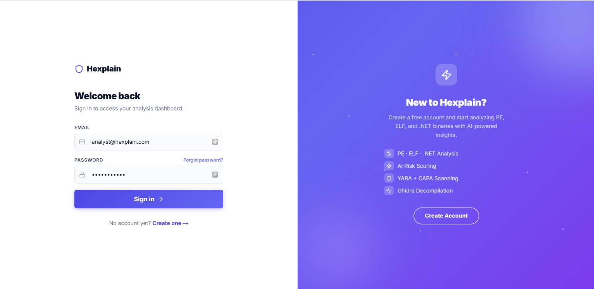
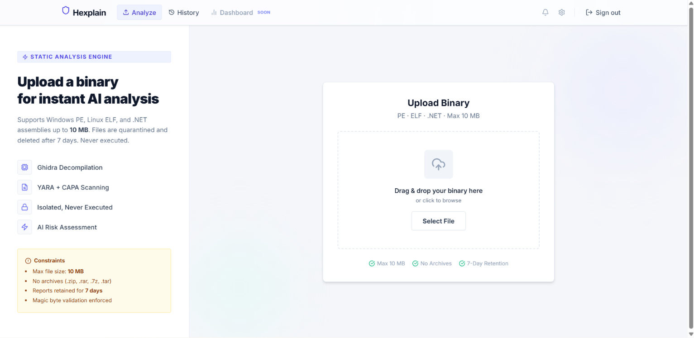
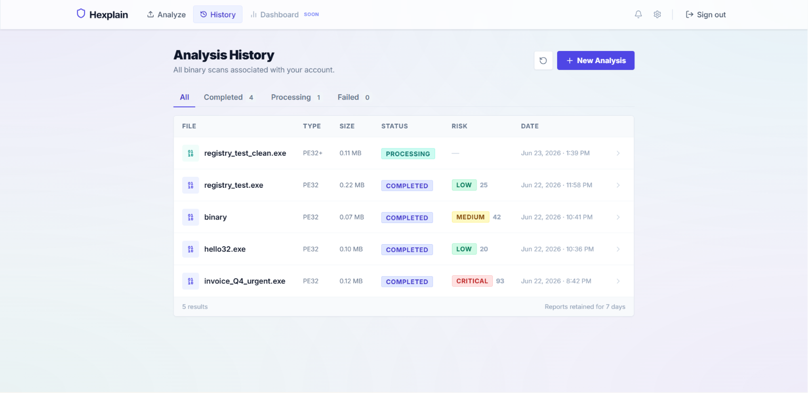
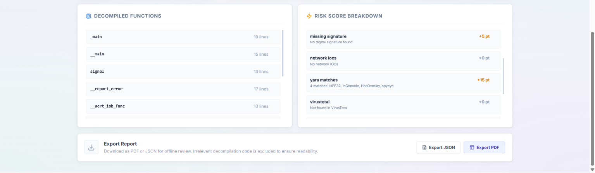
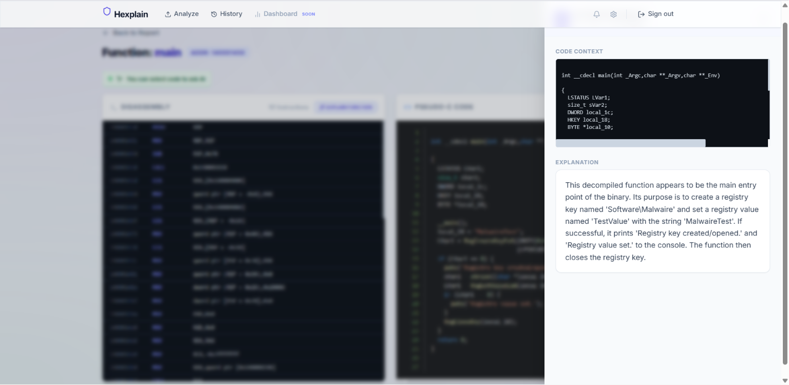
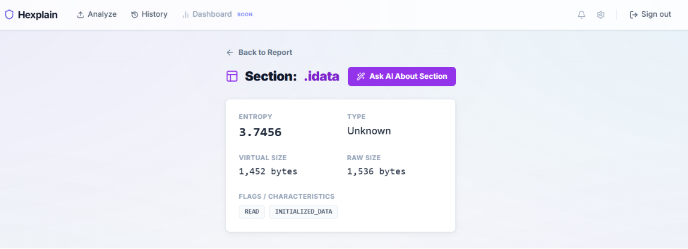

# Hexplain Frontend

The Hexplain frontend is a Next.js 14 application providing the full user interface for the binary analysis platform. It handles authentication, binary uploads, real-time analysis progress tracking, interactive report viewing, decompilation browsing, and the RAG chatbot interface.

---

## Technology Stack

| Technology | Version | Purpose |
|---|---|---|
| Next.js | 14 (App Router) | React framework with SSR/SSG support |
| TypeScript | 5.x | Type-safe JavaScript |
| Tailwind CSS | 3.x | Utility-first CSS framework |
| @react-pdf/renderer | Latest | Client-side PDF report generation |

---

## Application Structure

```
frontend/
├── src/
│   ├── app/                         # Next.js App Router
│   │   ├── layout.tsx               # Root layout (fonts, global styles, Navbar)
│   │   ├── page.tsx                 # Landing page (/)
│   │   ├── globals.css              # Global CSS, custom animations, design tokens
│   │   ├── login/
│   │   │   └── page.tsx             # Authentication page (login + register tabs)
│   │   ├── register/
│   │   │   └── page.tsx             # Registration redirect
│   │   ├── upload/
│   │   │   └── page.tsx             # Binary upload interface
│   │   └── jobs/
│   │       ├── page.tsx             # Analysis history list
│   │       └── [id]/
│   │           ├── page.tsx         # Job detail + live pipeline progress
│   │           ├── report/
│   │           │   ├── page.tsx          # Full analysis report
│   │           │   ├── function/
│   │           │   │   └── [name]/
│   │           │   │       └── page.tsx  # Function detail (assembly + pseudo-C)
│   │           │   ├── section/
│   │           │   │   └── [name]/
│   │           │   │       └── page.tsx  # Binary section detail
│   │           │   └── capability/
│   │           │       └── [name]/
│   │           │           └── page.tsx  # Capa capability detail
│   │           └── chat/
│   │               └── page.tsx     # RAG chatbot interface
│   ├── components/
│   │   ├── Navbar.tsx               # Top navigation bar
│   │   └── PdfReport.tsx            # PDF report renderer component
│   └── lib/
│       ├── api.ts                   # Typed API client (all backend requests)
│       └── utils.ts                 # Helper utilities (formatting, risk colors)
├── public/                          # Static assets (favicon, images)
├── Dockerfile                       # Production Next.js build
├── next.config.mjs                  # Next.js configuration
├── tailwind.config.ts               # Tailwind CSS configuration
├── tsconfig.json                    # TypeScript configuration
└── package.json                     # Dependencies and scripts
```

---

## Pages Overview

### Landing Page (`/`)

Public homepage presenting the platform value proposition with a call-to-action to sign up or log in.


### Authentication (`/login`)

Dual-panel authentication interface with sliding tab animation between Login and Register forms. Implements CSRF token retrieval and HttpOnly cookie authentication.



### Upload (`/upload`)

Drag-and-drop binary upload interface. Displays accepted formats (PE/ELF/.NET), file size limit, and submits via multipart form with CSRF header.



### Analysis History (`/jobs`)

Paginated list of all analysis jobs for the authenticated user, showing filename, submission date, status badge, and risk score badge.



### Live Analysis Progress (`/jobs/[id]`)

Real-time pipeline tracking via 3-second polling. Displays each of the 9 pipeline stages with status indicators (pending, running, done, error). Includes a Live Explorer panel showing partial results as they become available.


### Analysis Report (`/jobs/[id]/report`)

Full interactive report divided into sections:
- Executive summary (LLM-generated)
- Risk score breakdown by factor
- YARA rule matches
- Suspicious API calls by category
- IOC list (URLs, IPs, registry keys, file paths)
- Capa capabilities mapped to MITRE ATT&CK
- Binary sections with entropy visualization
- Decompiled functions list




### Function Detail (`/jobs/[id]/report/function/[name]`)

Side-by-side view of raw x86 disassembly (with addresses and opcodes) and Ghidra-generated pseudo-C. Includes "Explain Function" button that opens an AI explanation drawer.




### Section Detail (`/jobs/[id]/report/section/[name]`)

Technical details for a binary section: Shannon entropy, type, virtual size, raw size, and flags. Includes "Ask AI About Section" button for contextual explanation.



### RAG Chatbot (`/jobs/[id]/chat`)

Multi-session conversational interface. The chatbot answers questions about the analyzed binary using only the indexed report content. Supports chat history and multi-turn conversations.


---

## Development Setup

### Prerequisites

- Node.js 18+
- npm or yarn
- Backend API running at `http://localhost:8000`

### Install and Run

```bash
cd frontend

# Install dependencies
npm install

# Start development server (with hot reload)
npm run dev
```

The application will be available at `http://localhost:3000`.

### Environment Variables

Create a `.env.local` file in the `frontend/` directory:

```env
# Backend API URL (used for server-side requests in Next.js)
NEXT_PUBLIC_API_URL=http://localhost:8000
```

### Build for Production

```bash
npm run build
npm start
```

---

## Running with Docker

The frontend is included in the root `docker-compose.yml`. To run it in isolation:

```bash
docker build -t hexplain-frontend .
docker run -p 3000:3000 -e NEXT_PUBLIC_API_URL=http://localhost:8000 hexplain-frontend
```

---

## API Communication

All API calls are centralized in `src/lib/api.ts`. The client:

- Automatically reads the CSRF token from the `csrf_token` cookie
- Includes `X-CSRF-Token` header on all state-changing requests (POST, PUT, DELETE)
- Sends credentials (cookies) with every request via `credentials: 'include'`
- Returns typed response objects matching the backend Pydantic schemas

Example usage:

```typescript
import { api } from '@/lib/api'

// Upload a binary
const job = await api.upload(file)

// Poll for status
const status = await api.getJob(job.job_id)

// Get full report
const report = await api.getReport(job.job_id)

// Send chat message
const response = await api.sendChatMessage(job.job_id, sessionId, message)
```

---

## Design System

The interface follows a consistent visual language defined in `globals.css` and `tailwind.config.ts`:

- Background: `#f0f2f5` (light gray)
- Primary accent: `#6366f1` (indigo)
- Risk level colors: green (clean), blue (low), yellow (medium), orange (high), red (critical)
- Typography: Inter (headings), system monospace (code blocks)
- Animations: CSS keyframe animations for pipeline steps, hover lift effects, pulse glows
- Glassmorphism: backdrop-blur panels for modals and drawers

---

## Code Quality

```bash
# Lint
npm run lint

# Type check
npx tsc --noEmit
```
